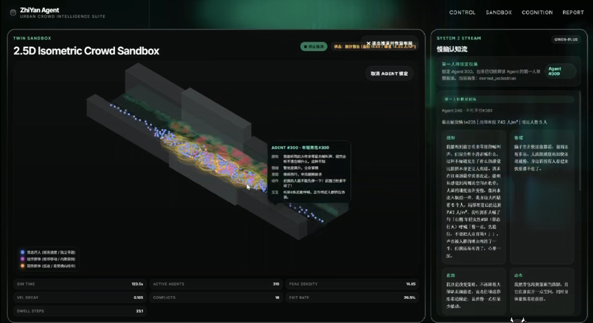
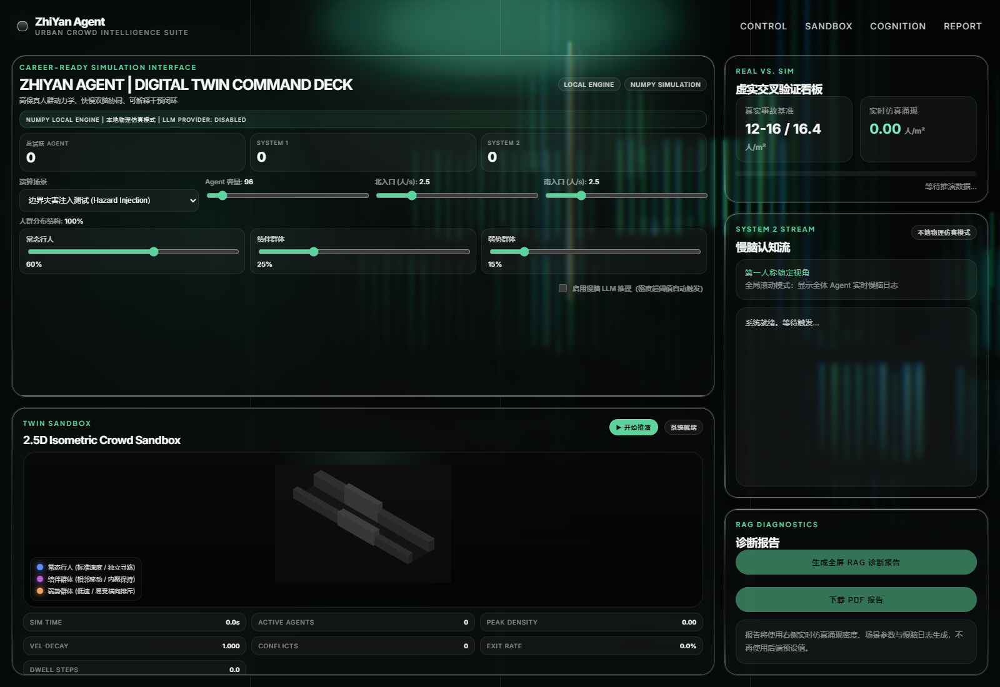
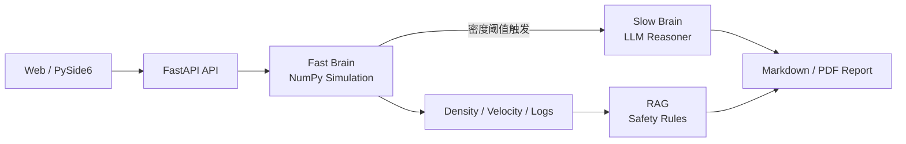
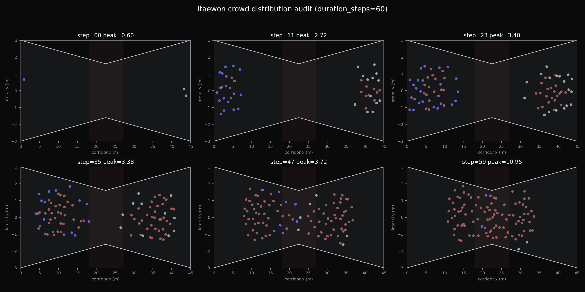

# 智演 Agent

### 面向高密度人群风险复演与干预评估的快慢双脑多智能体系统

> 第二十八届中国机器人及人工智能大赛国奖项目

`Multi-Agent System` · `Social Force Model` · `Fast-Slow Brain` · `RAG` · `Digital Twin`

智演 Agent 面向狭窄街巷、活动入口和交通瓶颈中的高密度人群风险，将社会力模型驱动的连续仿真与大语言模型驱动的个体认知推演结合，用同一套系统回答三个问题：**风险如何形成、个体为何采取特定行动、干预措施能否降低拥堵**。项目最终形成“场景复演 -> 风险诊断 -> 规范检索 -> 干预再仿真 -> 报告输出”的完整闭环。



<p align="center"><sub>图 1：历史运行截帧，展示 2.5D 人群沙盒、Agent 第一人称认知流与风险指标。截图仅作为功能界面证据，实验结论以 <code>docs/results/</code> 为准。</sub></p>

## 30 秒看懂项目

| 面试官关心的问题 | 本项目的回答 |
|---|---|
| 做了什么 | 构建可交互的人群数字孪生原型，支持事故复演、个体行为解释、RAG 风险诊断和三类物理干预复演 |
| 解决什么问题 | 解决传统人群仿真“只有粒子运动、缺少个体认知解释”，以及生成式报告“缺少仿真证据和规范约束”的割裂问题 |
| 技术难点 | 高密度碰撞计算、快慢双脑调度、历史目标校准、仿真与知识检索的数据闭环、无 API Key 降级运行 |
| 项目成果 | 获第二十八届中国机器人及人工智能大赛国奖；公开版提供源码、实验脚本、机器可读结果和真实运行截图 |
| 我的角色 | 项目负责人，主导系统架构、人群仿真优化、历史场景校准、RAG 诊断链路、干预策略映射与整体联调 |

## 项目成果与个人贡献

我没有把项目包装成单一的“LLM + 可视化”演示，而是围绕可运行、可解释和可复现三个目标推进工程实现。

| 问题 | 我采取的措施 | 公开证据 |
|---|---|---|
| 连续物理仿真与复杂推理争夺计算预算 | 设计快慢双脑（Fast-Slow Brain）分层：NumPy 快脑逐步更新物理状态，只有风险阈值触发时才调度 LLM 慢脑 | 300 Agent 容量上限、120 步本地仿真实测 **56.98 step/s**；实际最大同时活跃 157 Agent |
| 高密度区域出现穿模、过早排空或峰值偏离 | 向量化交互力与碰撞计算，调节核心区压力、局部交互半径和高压停留机制，并区分校准结果与独立实验 | 历史调优留档达到 **16.33 人/m²**，相对 16.4 目标的校准误差约 **0.43%**；该数字不称为模型准确率 |
| 诊断结论与仿真过程、规范材料割裂 | 将真实仿真摘要、密度/速度序列、微观行为日志与本地安全规则片段送入 LangChain + ChromaDB 链路 | 可生成指标表、风险时间线、行为摘录、规则映射和 Markdown/PDF 报告 |
| 整改建议停留在文字层 | 把中央护栏、单向导流、出口拓宽映射为可执行的边界、碰撞和寻路参数，使用固定种子做成对复演 | 三种子复跑中，单向导流的峰值密度均值由 6.433 降至 4.947 人/m²，下降 **23.10%** |

## 核心界面



<p align="center"><sub>图 2：公开仓库当前版本在无 .env 环境下的控制台。物理仿真可直接运行，LLM Provider 未配置时开关保持禁用。</sub></p>

界面将场景、Agent 容量、双向客流和人群画像比例集中在控制区；沙盒区呈现空间分布、风险热力与统计指标；认知区支持观察单个 Agent 的感知、情绪、意图和动作；报告区把宏观指标与微观日志组合为可追溯诊断材料。

## 系统架构



系统的核心设计原则是让确定性计算和生成式推理各自承担合适的工作。快脑负责高频位置、速度、碰撞、压力和热力图更新；慢脑只在局部密度达到风险阈值时，为代表性 Agent 生成结构化感知与行动。报告层消费的不是前端预设值，而是仿真返回的汇总指标、时间序列和日志。

## 核心方法

### 1. 向量化人群动力学

物理层参考社会力模型（Social Force Model），为每个行人建模期望速度、局部排斥、对向冲突、边界约束和压力传播。高频交互力与碰撞计算使用 NumPy 向量化实现，热力图按固定间隔缓存；在事故场景中，漏斗边界、核心压力和高密停留共同驱动拥堵涌现。仿真请求支持显式 `random_seed`，便于对不同干预策略进行配对比较。

### 2. 快慢双脑与可解释个体行为

系统借鉴 Talker-Reasoner 的快慢分工思想。未配置 API 时，本地场景推理器根据 Agent 画像、邻域密度、听到的呼救和干预状态生成确定性行为日志，物理仿真不受影响；配置 OpenAI-compatible Provider 后，风险阈值会触发 LLM 慢脑，输出 `perception`、`emotion`、`intention`、`dialogue`、`action` 和 `movement_hint`，再由动作映射影响局部移动。

### 3. RAG 风险诊断

诊断层使用 LangChain、进程内 ChromaDB 和本地规则文本，将仿真峰值、危险持续时间、速度衰减、对向冲突、Agent 行为摘录与检索片段组合成报告。公开版不启动或暴露 Chroma HTTP Server，只访问本地持久化索引；仓库只提供与消防疏散有关的示例规则片段，不声称包含完整法规知识库。这些内容用于演示“仿真证据 -> 检索依据 -> 整改建议”的工程链路，不能替代专业安全评估。

### 4. 可执行干预闭环

中央护栏改变碰撞边界并分隔对向人流，单向导流调整生成方向和目标车道，出口拓宽改变通道半宽。三种策略作用于实际仿真逻辑，而非只绘制前端覆盖层。用户可以在相同 Agent 容量、步数和种子下对比干预前后的峰值密度、危险步数和出口通过率。

## 实验与证据

本仓库把数字分为“公开版实测”和“历史目标校准”两类。实测结果可由当前脚本重新生成；历史校准记录的是针对已知目标反复调参后的结果，只说明调参贴合程度，不表示对未知场景的预测精度。

### 本地性能基准

| 配置 | 观测结果 |
|---|---:|
| 场景 | `accident`，仅本地物理仿真 |
| Agent 容量上限 / 实际最大活跃 | 300 / 157 |
| 仿真步数 / 随机种子 | 120 / 20260824 |
| 总耗时 | 2.1061 s |
| 吞吐 | **56.98 step/s** |
| 运行环境 | Python 3.12.3，Windows 11，Intel64 Family 6 Model 183 |

结果文件见 [`docs/results/benchmark.json`](docs/results/benchmark.json)。吞吐受处理器、Python/NumPy 版本和场景参数影响，不应视为跨硬件固定值。

### 干预成对实验

实验使用 `mitigation` 场景、300 Agent 容量上限、120 步和 3 个固定种子。每种策略与无干预基准共享种子。

| 策略 | 峰值密度均值（人/m²） | 相对基准变化 |
|---|---:|---:|
| 无干预 | 6.433 | 基准 |
| 中央护栏 | 5.940 | -7.66% |
| 单向导流 | **4.947** | **-23.10%** |
| 出口拓宽 | 5.940 | -7.66% |

结果文件见 [`docs/results/interventions.json`](docs/results/interventions.json)。`n=3` 的实验用于工程回归和方案比较，不提供统计显著性结论；当前参数下单向导流效果最好，不代表所有空间和客流条件下的普遍排序。

### 历史目标校准

2026-04-28 的调优记录以 16.4 人/m² 为已知目标，通过调整核心压力、局部交互半径和高压停留机制得到 16.33 人/m²，绝对差 0.07 人/m²、相对校准误差约 0.43%。这是**校准结果，不是准确率，也不是当前公开版性能基准**。脱敏摘要见 [`docs/results/historical-calibration.json`](docs/results/historical-calibration.json)。



<p align="center"><sub>图 3：60 步事故场景中人群由两侧向漏斗核心区汇聚的空间演化，用于检查分布和边界行为。</sub></p>

### 复现实验

```powershell
# 性能基准
python scripts/benchmark_simulation.py `
  --agents 300 --steps 120 --seed 20260824 `
  --output docs/results/benchmark.json

# 三种干预的固定种子成对比较
python scripts/evaluate_interventions.py `
  --agents 300 --steps 120 `
  --seeds 20260824 20260825 20260826 `
  --output docs/results/interventions.json
```

## 快速开始

### 1. 安装

可复现环境使用 Python 3.11。Windows PowerShell 示例：

```powershell
git clone https://github.com/Leizhidong-creator/Multi-Agent-Disaster-Simulation.git
Set-Location Multi-Agent-Disaster-Simulation

python -m venv .venv
.\.venv\Scripts\Activate.ps1
python -m pip install --upgrade pip
python -m pip install -r requirements.lock
```

`requirements.txt` 维护直接依赖版本，`requirements.lock` 固化完整传递依赖图，用于复现实验环境。

### 2. 无 Key 本地模式

```powershell
python -m uvicorn app.main:app --host 127.0.0.1 --port 8000
```

打开 [http://127.0.0.1:8000](http://127.0.0.1:8000)。不创建 `.env` 也能运行物理仿真、干预比较和确定性功能；LLM 慢脑保持禁用。

### 3. 可选 LLM / RAG 模式

```powershell
Copy-Item .env.example .env
```

在本地 `.env` 中填写自己的 OpenAI-compatible API 配置后重启服务。`.env` 已被 Git 忽略，请勿提交真实密钥。首次构建本地向量索引可能需要下载 embedding model：

```powershell
python scripts/build_fire_safety_index.py
```

### 4. 发布前安全检查

公开版不包含真实 API Key、个人身份信息、竞赛申报材料或内部 Agent 指令。浏览器端会对 LLM/RAG 生成的 Markdown 做标签与属性白名单过滤，PDF 导出前会转义不受信任的富文本。提交前可运行：

```powershell
python scripts/security_scan.py --worktree --staged --history
```

扫描结果只输出规则名、文件和行号，不回显命中的敏感值；它用于降低误提交风险，不能替代专业安全审计。

## 主要接口

| 方法 | 路径 | 作用 |
|---|---|---|
| `GET` | `/api/health` | 服务健康检查 |
| `GET` | `/api/bootstrap` | 场景、阈值、运行限制和 Provider 状态 |
| `POST` | `/api/simulate` | 运行人群仿真并返回帧、日志和汇总指标 |
| `POST` | `/api/engine/run` | 运行底层沙盒引擎 |
| `POST` | `/api/report` | 生成 Markdown 诊断报告 |
| `POST` | `/api/report/pdf` | 导出 PDF 报告 |

FastAPI 交互文档位于 `http://127.0.0.1:8000/docs`。

## 项目结构

```text
.
├── app/
│   ├── api/              # FastAPI 路由
│   ├── engine/           # 沙盒、LLM、RAG 与 PDF 输出
│   ├── models/           # Pydantic 请求/响应协议
│   └── services/         # 仿真、慢脑、报告和运行服务
├── frontend/             # 2.5D 控制台与交互逻辑
├── scripts/              # 建库、验证、性能和干预实验
├── tests/                # 本地降级与实验契约测试
├── docs/assets/          # 已核验界面与实验图片
├── docs/results/         # 机器可读实验留档
├── fire_safety_rules.txt # 公开示例规则文本
└── .env.example          # 不含真实凭据的配置模板
```

## 当前局限与未来工作

当前系统是科研与竞赛原型，不是经过主管部门认证的生产级人群安全平台。几何与人流参数主要来自文献锚点和工程化抽象，尚未使用多场景真实轨迹做外部验证；历史目标校准也需要在后续版本建立自动回归，避免代码演进造成口径漂移。

LLM 慢脑会引入网络时延、调用成本和生成不确定性，因此公开版默认关闭，并保留本地确定性路径。RAG 数据目前是少量示例规则，不支持完整法规覆盖或正式合规判断。干预实验样本数有限，未来将增加更多种子、客流强度、空间形态和消融实验，并报告置信区间与跨场景稳定性。

## 方法参考

1. Helbing, D., & Molnár, P. (1995). *Social force model for pedestrian dynamics*. Physical Review E, 51(5), 4282-4286. [https://doi.org/10.1103/PhysRevE.51.4282](https://doi.org/10.1103/PhysRevE.51.4282)
2. Helbing, D., Farkas, I., & Vicsek, T. (2000). *Simulating dynamical features of escape panic*. Nature, 407, 487-490. [https://doi.org/10.1038/35035023](https://doi.org/10.1038/35035023)
3. Christakopoulou, K., Mourad, S., & Matarić, M. (2024). *Agents Thinking Fast and Slow: A Talker-Reasoner Architecture*. arXiv:2410.08328. [https://arxiv.org/abs/2410.08328](https://arxiv.org/abs/2410.08328)

引用元数据的核验来源见 [`sources/research_foundational_methods.md`](sources/research_foundational_methods.md)。

## 免责声明与许可证

本项目用于科研展示、教学和方案预研。仿真结果不能替代现场勘察、专业工程计算、法规审查或应急指挥决策；公开规则文本仅用于演示 RAG 链路。

代码以 [MIT License](LICENSE) 发布。引用本项目时可使用仓库中的 [`CITATION.cff`](CITATION.cff)。
