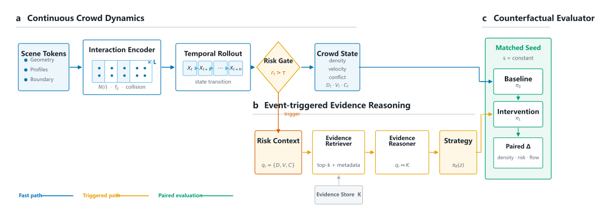
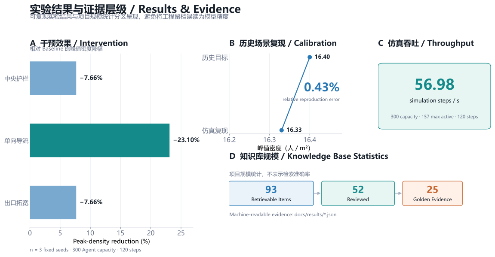

<div align="center">


### 面向城市高密度人群风险治理的快慢思考多智能体系统

*A Fast-Slow Multi-Agent System for Risk-aware Crowd Governance*

**第二十八届中国机器人及人工智能大赛 · 国家级奖项（国奖）** · 项目负责人 · 2026

<kbd>Multi-Agent Simulation</kbd> &nbsp; <kbd>Social Force Model</kbd> &nbsp; <kbd>Fast-Slow Reasoning</kbd> &nbsp; <kbd>RAG Diagnosis</kbd>

[摘要](#abstract) · [方法](#method) · [实验](#results) · [复现指南](#reproduction) · [引用](#references)

</div>

<a id="abstract"></a>

##  摘要 / Abstract

面向高密度人群场景中**风险识别滞后、规范检索与疏散推演相互割裂**的问题，智演 Agent 构建“实时仿真—风险诊断—规范检索—干预复演”的多智能体治理闭环。系统以向量化社会力模型持续推进群体状态，仅在风险阈值触发时调度 Slow Brain，并将仿真指标、个体行为与本地规则证据组织为可追溯诊断；中央护栏、单向导流和出口拓宽等建议进一步被转换为可执行参数，在相同随机种子下进行反事实复跑。公开版同时提供无 API Key 的确定性路径、实验脚本与机器可读结果，使方法、证据和工程实现能够被独立检查。

<a id="method"></a>

##  方法概览 / Method

<p align="center">
  
</p>

<p align="center"><sub><b>图 1｜方法架构。</b> Fast Brain 持续推进群体状态；风险门控只在异常时激活 Slow Brain；干预策略必须回到同种子仿真中接受成对验证。</sub></p>

**Fast Brain：高频群体演化。** 场景拓扑、出入口、障碍物与异质群体画像被编码为初始状态；[`simulation.py`](app/services/simulation.py) 通过 NumPy 向量化计算局部交互力、碰撞与边界约束，并沿 `t → t+1 → … → t+n` 连续输出密度、速度、拥堵和行为轨迹。

**Risk-aware Gating：事件触发调度。** 快脑在每个仿真步评估密度、速度衰减和对向冲突。常态阶段保持低成本物理更新；超过阈值时才抽取异常区域与代表性 Agent 上下文，避免复杂推理持续占用仿真预算。

**Slow Brain：证据增强推理。** [`slow_brain.py`](app/services/slow_brain.py) 组织 Agent 的感知、情绪、意图、对话与动作；[`rag.py`](app/engine/rag.py) 将风险上下文映射到规则、案例和研究材料，再由诊断链生成带证据来源的干预参数。未配置 LLM Provider 时，系统自动使用本地确定性推理器，不中断物理仿真。

**Matched-seed Replay：反事实闭环。** 中央护栏、单向导流和出口拓宽作用于实际边界、生成方向与寻路参数。Baseline 与 Intervention 共享随机种子，输出峰值密度、危险持续时间、出口通过率、行为摘录和报告，形成可比较而非只可阅读的治理建议。

<a id="contributions"></a>

##  主要贡献 / Contributions

1. **快慢双脑架构。** 针对人群仿真既要连续推进、又要支持复杂风险判断的问题，将高频 NumPy 物理演化与事件触发的 LLM / Local Slow Brain 解耦，降低多智能体并行中的推理成本。
2. **可解释群体动力学。** 将社会力模型、异质群体画像、时序状态传播和个体行为日志纳入同一仿真环境，使宏观拥堵形成过程能够追溯到局部交互与 Agent 决策。
3. **证据增强风险诊断。** 针对消防规范、事故案例与疏散研究分散的问题，构建 ChromaDB + LangChain RAG 链路，把指标、行为与检索证据共同写入诊断报告。
4. **可执行干预验证。** 将治理建议映射为可调仿真参数，并以同种子成对复跑衡量相对变化，使“风险展示”进一步转化为可检验的决策支持流程。

<a id="results"></a>

##  实验结果 / Results

<p align="center">
  
</p>

<p align="center"><sub><b>图 2｜结果与证据层级。</b> 图中前三组为仓库留档的可复现实验；知识库条目为项目规模统计，不表示检索准确率。</sub></p>

| 评估问题 | 结果 | 实验边界与证据 |
|---|---:|---|
| 历史场景能否复现已知峰值密度 | 复现相对误差 **0.43%** | 单目标历史校准，不称为准确率或外部验证；见 [`historical-calibration.json`](docs/results/historical-calibration.json) |
| 干预能否在相同初始条件下降低拥堵 | 单向导流使峰值密度降低 **23.10%** | 3 个固定种子、300 Agent 容量、120 步的成对工程实验；见 [`interventions.json`](docs/results/interventions.json) |
| 本地物理层能否持续推进 | **56.98 simulation steps/s** | `accident` 场景、120 步、最大同时活跃 157 Agent；运行环境与耗时见 [`benchmark.json`](docs/results/benchmark.json) |
| 知识工程覆盖到什么规模 | 93 条可检索、52 条 reviewed、25 条 golden | 项目建设统计，不作为 Recall、准确率或模型性能结论 |

这里的 `0.43%` 衡量**已知目标与校准结果之间的相对误差**，不能通过简单取补数改写成模型准确率。干预实验用于验证代码回归和方案间相对差异；当前参数下单向导流降幅最大，但 `n=3` 不支持统计显著性或跨场景普遍排序。吞吐结果同样受 CPU、Python / NumPy 版本与场景负载影响。

<details>
<summary><b>查看实验配置与复现命令</b></summary>

```powershell
# 本地物理仿真吞吐
python scripts/benchmark_simulation.py `
  --agents 300 --steps 120 --seed 20260824 `
  --output docs/results/benchmark.json

# 三类干预与 Baseline 的同种子成对比较
python scripts/evaluate_interventions.py `
  --agents 300 --steps 120 `
  --seeds 20260824 20260825 20260826 `
  --output docs/results/interventions.json

# 从 JSON 留档重新生成 README 科研图
python scripts/generate_readme_figures.py
```

</details>

<a id="reproduction"></a>

##  复现指南 / Reproduction

### 1. 环境安装

推荐 Python 3.11。Windows PowerShell 示例：

```powershell
git clone https://github.com/Leizhidong-creator/Multi-Agent-Disaster-Simulation.git
Set-Location Multi-Agent-Disaster-Simulation

python -m venv .venv
.\.venv\Scripts\Activate.ps1
python -m pip install --upgrade pip
python -m pip install -r requirements.lock
```

`requirements.txt` 维护直接依赖，`requirements.lock` 固化完整传递依赖图。

### 2. 无 Key 本地模式

```powershell
python -m uvicorn app.main:app --host 127.0.0.1 --port 8000
```

访问 [http://127.0.0.1:8000](http://127.0.0.1:8000)。不创建 `.env` 也可运行物理仿真、确定性个体解释、干预比较和报告骨架；LLM Slow Brain 保持禁用。

### 3. 可选 LLM / RAG 模式

```powershell
Copy-Item .env.example .env
python scripts/build_fire_safety_index.py
```

仅在本地 `.env` 中填写 OpenAI-compatible Provider。仓库中的 [`.env.example`](.env.example) 只有变量名与占位值，`.env` 已被 Git 忽略；本地向量索引使用进程内 ChromaDB，不公开启动 Chroma HTTP Server。

### 4. 发布前安全检查

```powershell
python scripts/security_scan.py --worktree --staged --history
```

公开版不包含真实 API Key、个人身份信息、竞赛申报材料或内部 Agent 指令。扫描器只报告规则名、文件和行号，不回显疑似敏感值。

<details>
<summary><b>主要 API</b></summary>

| 方法 | 路径 | 作用 |
|---|---|---|
| `GET` | `/api/health` | 服务健康检查 |
| `GET` | `/api/bootstrap` | 场景、阈值、运行限制与 Provider 状态 |
| `POST` | `/api/simulate` | 返回仿真帧、行为日志与汇总指标 |
| `POST` | `/api/engine/run` | 运行底层沙盒引擎 |
| `POST` | `/api/report` | 生成 Markdown 诊断报告 |
| `POST` | `/api/report/pdf` | 导出 PDF 报告 |

FastAPI 交互文档位于 `http://127.0.0.1:8000/docs`。

</details>

<a id="structure"></a>

##  项目结构 / Repository Structure

```text
.
├── app/
│   ├── api/              # FastAPI 路由与公开协议
│   ├── engine/           # 沙盒、LLM、RAG 与 PDF 输出
│   ├── models/           # Pydantic 请求/响应模型
│   └── services/         # 仿真、Slow Brain、报告和运行服务
├── frontend/             # 2.5D 控制台与交互逻辑
├── scripts/              # 建库、实验、图表与安全检查
├── tests/                # 本地降级、安全和实验契约测试
├── docs/assets/          # 科研图与资产来源说明
├── docs/results/         # 机器可读实验留档
├── sources/              # 基础方法引用核验记录
├── fire_safety_rules.txt # 公开 RAG 示例规则
└── .env.example          # 不含真实凭据的配置模板
```

<a id="limitations"></a>

##  局限性 / Limitations

- **外部有效性：** 当前几何与人流参数主要来自文献锚点和工程化抽象，尚未使用多场景真实轨迹完成外部验证；历史目标校准只说明对已知目标的贴合程度。
- **实验规模：** 干预结果来自 3 个固定种子的工程对比，尚未覆盖更多客流强度、空间形态、置信区间与消融实验。
- **知识评测：** RAG 已建立 reviewed / golden 分层，但公开版尚未提供可独立运行的 Recall@k 基准，因此不发布检索准确率结论。
- **生成不确定性：** LLM Slow Brain 会引入时延、成本与输出波动，公开版默认关闭并保留本地确定性路径。
- **应用边界：** 本系统是科研与竞赛原型，不能替代现场勘察、专业工程计算、法规审查或应急指挥决策。

<a id="author-contributions"></a>

##  作者贡献 / Author Contributions

本项目由项目负责人主导总体方案与核心实现，贡献按 CRediT 风格说明如下：

| 贡献角色 | 具体工作 |
|---|---|
| **Conceptualization** | 定义“实时仿真—风险诊断—规范检索—干预复演”的闭环问题与系统边界 |
| **Methodology** | 设计 Fast-Slow 分层架构、风险触发机制、RAG 证据链和同种子反事实实验 |
| **Software** | 主导向量化人群动力学、Slow Brain、ChromaDB + LangChain 检索、干预参数映射与前后端联调 |
| **Validation** | 完成历史峰值密度校准、固定种子干预实验、吞吐测试与安全回归 |
| **Visualization** | 设计 2.5D 人群沙盒、实验审计图、方法架构图与结果展示体系 |
| **Project Administration** | 负责竞赛目标拆解、技术路线推进、整体交付与国奖项目管理 |

<a id="references"></a>

##  参考文献与引用 / References & Citation

1. Helbing, D. & Molnár, P. [*Social force model for pedestrian dynamics*](https://doi.org/10.1103/PhysRevE.51.4282). *Physical Review E*, 1995.
2. Helbing, D., Farkas, I. & Vicsek, T. [*Simulating dynamical features of escape panic*](https://doi.org/10.1038/35035023). *Nature*, 2000.
3. Lewis, P. et al. [*Retrieval-Augmented Generation for Knowledge-Intensive NLP Tasks*](https://arxiv.org/abs/2005.11401). *NeurIPS*, 2020.
4. Christakopoulou, K., Mourad, S. & Matarić, M. [*Agents Thinking Fast and Slow: A Talker-Reasoner Architecture*](https://arxiv.org/abs/2410.08328), 2024.

上述文献用于说明方法来源，不构成对本仓库实现或实验结论的背书。引用核验记录见 [`sources/research_foundational_methods.md`](sources/research_foundational_methods.md)。

```bibtex
@software{lei_zhiyan_agent_2026,
  author  = {Zhidong Lei},
  title   = {Zhiyan Agent: A Fast-Slow Multi-Agent System for Risk-aware Crowd Governance},
  year    = {2026},
  url     = {https://github.com/Leizhidong-creator/Multi-Agent-Disaster-Simulation},
  license = {MIT}
}
```

完整软件引用元数据见 [`CITATION.cff`](CITATION.cff)。代码以 [MIT License](LICENSE) 发布。
